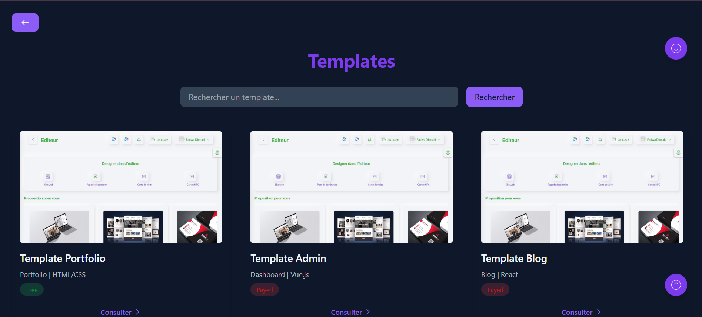

# 🌟 Temply

Temply est une **bibliothèque de composants frontend prêts à l’emploi**, classés par catégories.  
Elle permet aux développeurs et designers de **gagner du temps** en explorant, visualisant et réutilisant facilement du code moderne et responsive.  

---

## 🎯 Objectif

Faciliter le travail des développeurs et designers en proposant une plateforme :  
- Pour **explorer** des composants et templates (Landing pages, Portfolios, Dashboards, etc.)  
- Pour **visualiser un aperçu en direct** sur **Desktop, Tablet et Mobile**  
- Pour **copier directement le code** (HTML/CSS/Tailwind) prêt à l’usage  
- Pour **enregistrer en favoris** les templates utiles et les retrouver facilement  

---

## 🧩 Fonctionnalités principales

- 🔍 **Navigation par catégories** (Landing, Portfolio, Dashboard, Formulaires, etc.)  
- 👀 **Preview dynamique** sur plusieurs formats d’écran  
- 🧾 **Accès au code source** de chaque composant  
- 📋 **Copie rapide** du code HTML/CSS  
- ⭐ **Système de favoris** pour sauvegarder ses templates préférés  
- 👤 **Espace utilisateur** : gestion de son profil et des templates enregistrés  
- 📩 **Contactez-nous** directement depuis la plateforme  
- 💡 Interface responsive, claire et intuitive  

---

## 📸 Aperçu



---

## 🚀 Technologies utilisées

- [Vue 3](https://vuejs.org/) avec `<script setup>`  
- [Vite](https://vitejs.dev/) pour un bundling ultra-rapide  
- [Tailwind CSS](https://tailwindcss.com/) pour un style moderne et responsive  
- [Vue Router](https://router.vuejs.org/) pour la navigation  
- [Axios](https://axios-http.com/) pour la communication avec l’API  

---

## 🛠️ Installation locale

```bash
# Cloner le projet
git clone https://github.com/fadwadhmaid/Temply.git

# Accéder au dossier
cd Temply

# Installer les dépendances
npm install

# Lancer le serveur de développement
npm run dev
